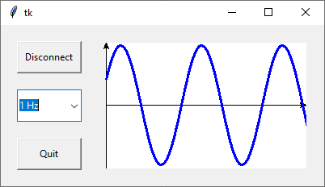
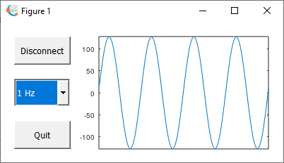
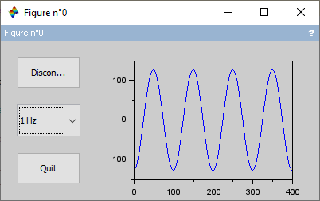
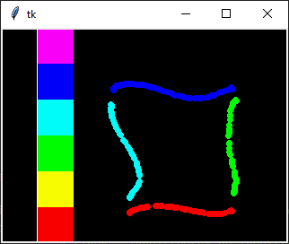
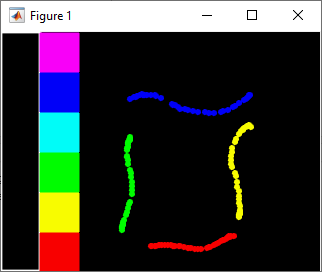
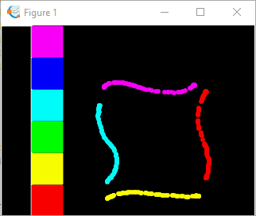
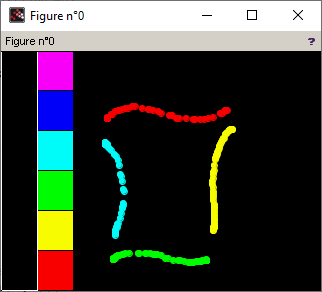

# Demos
Ce dossier contient des exemples évolués pour intéragir en temps réel et en continu avec la carte Arduino Uno.

## Sinusoid

Dans cet exemple, l'Arduino envoi un signal sinusoidale via l'UART (une valeur à la fois) et l'IHM affiche ce signal.

| Python                   |  MATLAB                  |
:-------------------------:|:-------------------------:
 | 
| GNU Octave               |  Scilab                  |
 | 

## Tftpaint

Dans cet exemple, un shield avec un écran TFT est fixé sur l'Arduino Uno. L'IHM reproduit le graphisme créé par l'utilisateur sur l'écran TFT.

Cet exemple nécessite l'écran TFT suivant : [ELEGOO 2.8 Inches TFT Touch Screen with SD Card Socket For Arduino](https://www.elegoo.com/products/elegoo-2-8-inches-tft-touch-screen).

| Python                   |  MATLAB                  |
:-------------------------:|:-------------------------:
 | 
| GNU Octave               |  Scilab                  |
 | 

## Licence
Tous les codes sont sous licence MIT.

## Support
Pour toute question ou remarque, envoyer un email à jbtechlab@gmail.com