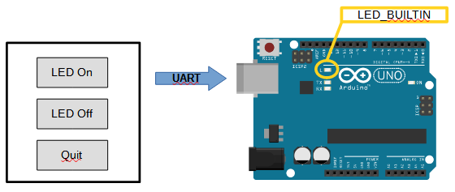
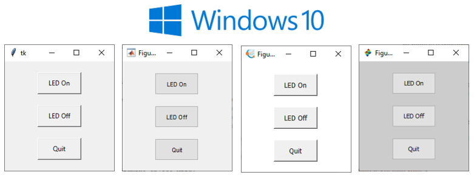
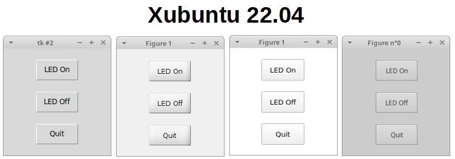
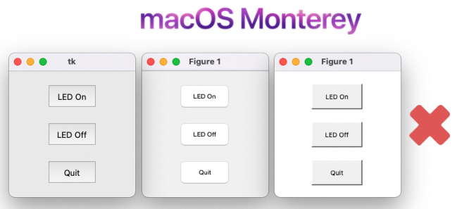

# Exemples
Ce dossier contient des exemples de base pour apprendre à intéragir avec la carte Aduino Uno via une communciation UART et grâce à des IHM en Python, MATLAB, GNU Octave et Scilab.

Les exemples sont évolutifs, de l'exemple 00 à l'exemple 04.

L'object est de créer une IHM pour allumer/éteindre la LED sur la carte Arduino :

## Exemple 00

L'exemple 00 montre comment gérer les ports série du PC (identification, ouverture, écriture, fermeture) pour communiquer avec l'Arduino. L'exemple 00 ne crée pas d'IHM.

## Exemple 01

L'exemple 01 montre comment communiquer en boucle avec l'Arduino par une saisie utilisateur via un terminal. L'exemple 01 ne crée pas d'IHM.

## Exemple 02

 L'exemple 02 montre comment créer une IHM avec 3 boutons :
 - LED On : allumage de la LED
 - LED Off : extinction de la LED
 - Quit : fermeture de la fenêtre

## Exemple 03

L'exemple 03 reprend le code de l'exemple 02 mais en utilisant un seul bouton pour allumer/éteindre la LED.

## Exemple 04

L'exemple 04 reprend le code de l'exemple 03 mais en permettant aux objets graphiques de suivre le redimensionnement de la fenêtre.

## Aperçu
Voici des aperçus des IHM créées avec l'exemple 02. De gauche à droite : Python, MATLAB, GNU Octave, Scilab.

## Licence
Tous les codes sont sous licence MIT.

## Support
Pour toute question ou remarque, envoyer un email à jbtechlab@gmail.com